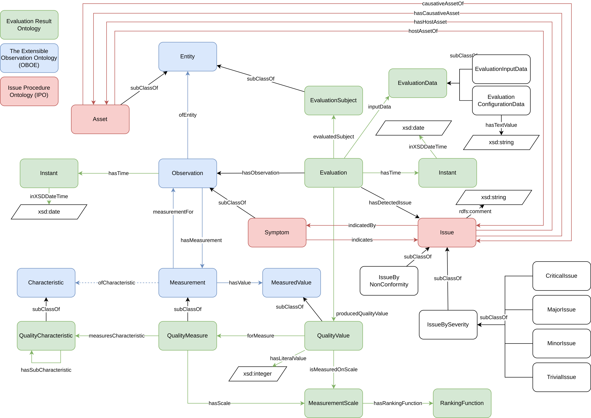

# OQUO in QASAR (OQUO-QASAR)

The OQUO-QASAR ontology is composed by 5 modules that follows the architecture described in the next figure:

## Modules

### oquo-core

The aligning of these ontologies resulted in the following schema:

### oquo-huron
The module oquo-huron ([https://purl.archive.org/oquo-huron](https://purl.archive.org/oquo-huron)) imports oquo-core and include the metrics, scales, and scale conversions from Huron[^huron]. The next figure shows an example of a result of applying the metric 'names per class' to the gene ontology class GO:0044208:

Additionally, an RDF example resulting of applying the metric 'classes with no description' to the BFO ontology is available [here](examples/BFO-classes_with_no_description.rdf).

### oquo-oquare
The module oquo-oquare ([https://purl.archive.org/oquo-oquare](https://purl.archive.org/oquo-oquare)) contains the information about the metrics included in OQuaRE[^oquare]. The next figure shows an example of a result of applying the metric 'LCOMOnto' to Gene Ontology.

### oquo-ontoenrich
The module oquo-ontoenrich ([https://purl.archive.org/oquo-ontoenrich](https://purl.archive.org/oquo-ontoenrich)) contains the information about the metrics provided by ontoenrich[^ontoenrich].

[^huron]: [https://doi.org/10.1109/ACCESS.2023.3316512](https://doi.org/10.1109/ACCESS.2023.3316512)
[^oquare]: [https://search.informit.org/doi/abs/10.3316/ielapa.265844843145749](https://search.informit.org/doi/abs/10.3316/ielapa.265844843145749)
[^ontoenrich]: [https://doi.org/10.1007/978-3-319-17966-7_25](https://doi.org/10.1007/978-3-319-17966-7_25)