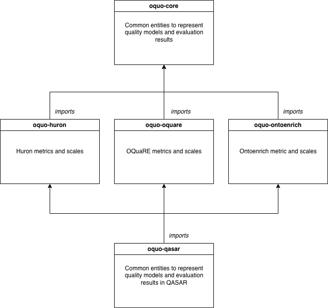

# OQUO in QASAR 

**OQUO-QASAR** is the configuration of the Ontology QUality Ontology (OQUO) that serves as the data model of [QASAR](https://semantics.inf.um.es/qasar), a web-based platform for ontology quality assurance. It bundles the OQUO core with the extension modules of the quality frameworks integrated into QASAR, so that their heterogeneous outputs can be represented, queried, and compared within a single, shared model.

OQUO provides the semantic definitions needed to describe quality models —based on metrics, characteristics, and sub-characteristics— together with the entities required to represent ontology evaluations, such as observations, measurements, scales, scale conversions, and issues. It reuses and aligns four existing ontologies (QMO, EVAL, OBOE, and IPO) in its core, and is extended by framework-specific modules that contribute the metrics of each tool.

QASAR consolidates four independently developed frameworks —OQuaRE, HURON, OntoEnrich, and Evaluome— into a single quality assurance workflow. Because all of them describe their results using OQUO-QASAR, the metrics produced by OQuaRE, HURON, and OntoEnrich become interoperable and can be aggregated on a common scale, while their evaluations, versions, and detected issues are represented in a uniform way. This modular, framework-agnostic design means that integrating a new framework only requires adding a new extension module, without changing the shared core.

This page describes the modular architecture of OQUO-QASAR and its modules, with examples of the RDF produced when each framework's metrics are applied to real ontologies.

The OQUO-QASAR ontology is composed by 5 modules that follows the architecture described in the next figure:

## Modules

### oquo-core

The aligning of these ontologies resulted in the following schema:

### oquo-huron
The module oquo-huron ([https://purl.archive.org/oquo-huron](https://purl.archive.org/oquo-huron)) imports oquo-core and include the metrics, scales, and scale conversions from Huron[^huron]. The next figure shows an example of a result of applying the metric 'names per class' to the gene ontology class GO:0044208:

Additionally, an RDF example resulting of applying the metric 'classes with no description' to the BFO ontology is available [here](examples/BFO-classes_with_no_description.rdf).

### oquo-oquare
The module oquo-oquare ([https://purl.archive.org/oquo-oquare](https://purl.archive.org/oquo-oquare)) contains the information about the metrics included in OQuaRE[^oquare]. The next figure shows an example of a result of applying the metric 'LCOMOnto' to Gene Ontology.

### oquo-ontoenrich
The module oquo-ontoenrich ([https://purl.archive.org/oquo-ontoenrich](https://purl.archive.org/oquo-ontoenrich)) contains the information about the metrics provided by ontoenrich[^ontoenrich].

[^huron]: [https://doi.org/10.1109/ACCESS.2023.3316512](https://doi.org/10.1109/ACCESS.2023.3316512)
[^oquare]: [https://search.informit.org/doi/abs/10.3316/ielapa.265844843145749](https://search.informit.org/doi/abs/10.3316/ielapa.265844843145749)
[^ontoenrich]: [https://doi.org/10.1007/978-3-319-17966-7_25](https://doi.org/10.1007/978-3-319-17966-7_25)